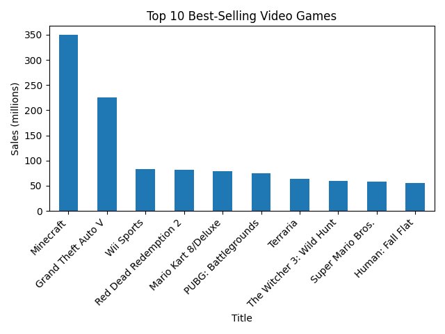
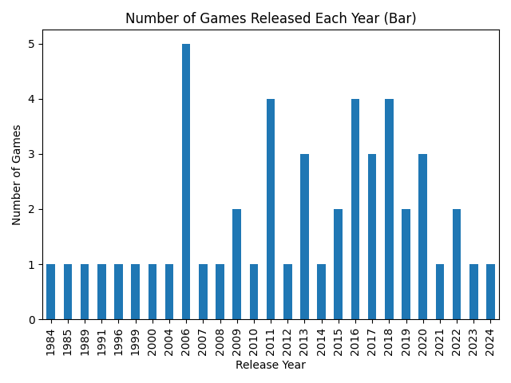
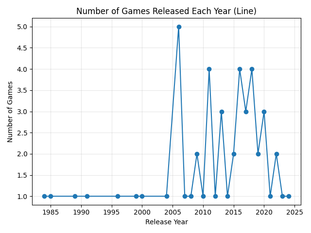
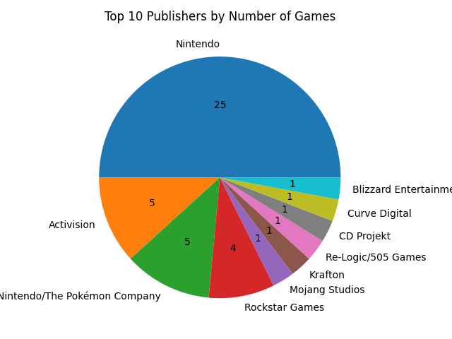

# Simple Video Games Data Analysis

## Description

This project analyzes and visualizes data about the most selling video games using Python.

The workflow of the project:

1. Download the dataset.
2. Clean and preprocess the data.
3. Analyze the data.
4. Create visualizations (for example pie charts) to better understand the results.

The project was created to practice:

* Python programming
* Data cleaning
* Data analysis
* Data visualization

## Dataset

The project uses the **Most Selling Video Games Dataset** from Kaggle.

Dataset link:
https://www.kaggle.com/datasets/vishardmehta/most-selling-video-games-dataset

The dataset is downloaded automatically using `kagglehub`.

Example:

```python
import kagglehub

path = kagglehub.dataset_download("vishardmehta/most-selling-video-games-dataset")
print("Path to dataset files:", path)
```

The dataset contains information such as:

* Game title
* Platform
* Publisher
* Release year
* Global sales

## Technologies

* Python
* pandas
* matplotlib
* kagglehub

## Visualizations

### Top 10 Selling Video Games


### Release Year Distribution
  

### Top Publishers



## Author

Bohdan)
